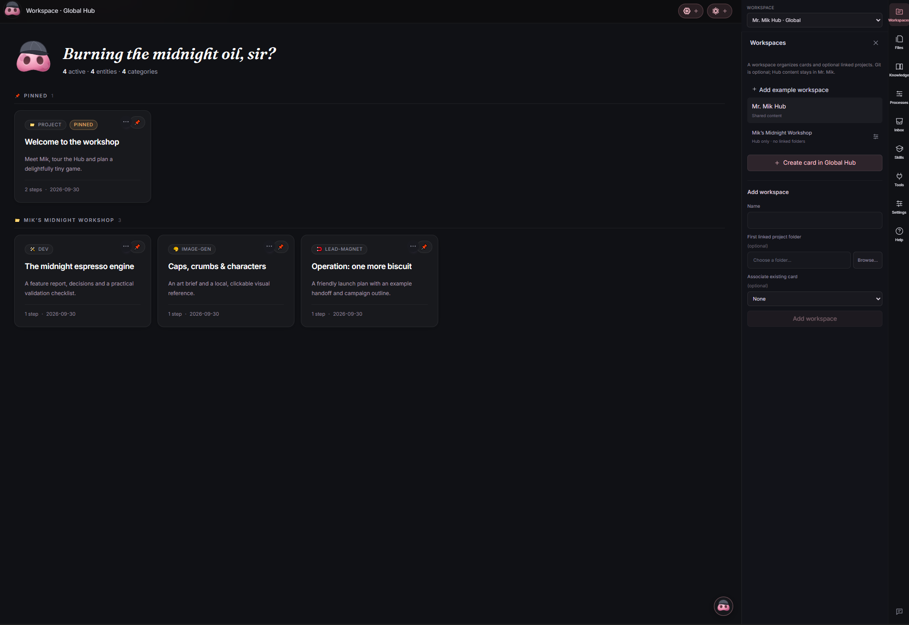
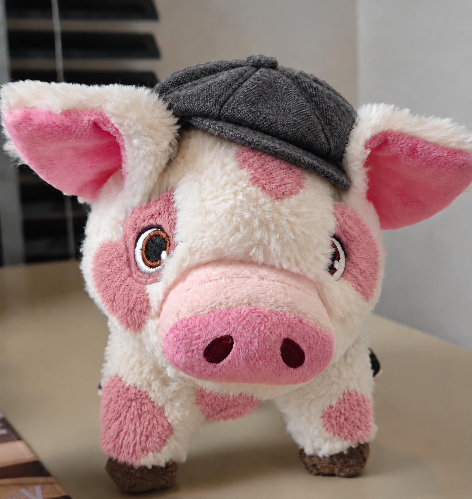

# Mr. Mik

The little brother of **Mr. Mak**: a local project hub for Codex and Claude Code.

Mr. Mik is an independently maintained fork of [Mr. Mak Workspace by witnesstodark](https://github.com/witnesstodark/mr-mak-workspace). The original creator's MIT license and copyright are preserved in [LICENSE](LICENSE). This is not an official upstream release or an OpenAI/Anthropic product.



## Current beta

**Beta 0.2.7:** independently maintained and not yet validated on every clean Windows installation. Use private backups before importing data or trying removal actions. Cards now have Archive/Restore/Delete menus; unlinking a project or removing a workspace lets you keep (default), archive or recycle its cards. External folders and native chats are not deleted by these actions. Page navigation lives inside card content, while card commands stay in the external banner.

New Hubs enable `workspace-authoring` and `feature-handoff` for both agents by default; workspace Off overrides remain available. Existing Hubs keep their settings. A compact routing instruction asks chats and Mik to consult these skills only for relevant card-content and handoff requests, without preloading full instructions.

The optional upstream skills `fal-ai-generation`, `higgsfield-workflow`, `motion-reference-workflow` and `voice-dictation-setup` are retained for both agents, Off by default in Hub controls. Enable only what you need. Provider tools/accounts are not bundled or automatically activated; local dictation setup is independent of the disabled conversational voice feature. Native CLI skill discovery is separate from Hub/Bridge scope switches.

### A small midnight workshop

The portable includes **Mik’s Midnight Workshop**: four disposable example cards for a fictional espresso-delivery game, five offline HTML pages and an original local SVG reference. Existing Hubs can add it from **Workspaces → Add example workspace** without overwriting personal content or edited examples. No external folder, tool activation or account is needed to browse it. Workspaces may start as Hub-only planning areas and link actual projects later.

## Mr. Mak and Mr. Mik

Mr. Mik keeps Mr. Mak's two-window approach: native agent chats beside a visual Workspace of cards and files. Cards, shared folders, chat History, native agent skills, MCP visibility and optional coordination already belong to the original foundation. This fork changes their organization and integration; it does not claim to have introduced those capabilities or to be the original application's official successor.

The comparison below describes the original project's documented approach at [upstream v0.4.15](https://github.com/witnesstodark/mr-mak-workspace/tree/v0.4.15) and this fork's customized workflows. It is not an exhaustive feature inventory; upstream continues to evolve independently.

| Area | Mr. Mak's documented approach | Mr. Mik's approach |
| --- | --- | --- |
| Organization | A local Workspace opened from a cloned template repository, organizing projects, research and media through cards and shared folders, with included starter examples. | A Hub containing logical workspaces, each with multiple linked project folders and work-area cards. Unity, Blender and marketing can belong to one logical workspace. |
| Files and project boundaries | The template repository holds Workspace content such as research, designs, reports and media. This does not mean each card is a Git repository or that external project code must live there. | Explicit associations connect cards and logical workspaces to external project folders. Organizational content stays in the Hub; cards may target a linked project or workspace planning, and Git is optional. |
| Knowledge, Processes and Inbox | Shared folders for lessons, workflows and incoming files. | Global and workspace-scoped Knowledge/Processes, shared Inbox storage with workspace associations, and global Context. |
| Skills and tools | Native agent skills and visibility into project/global MCP configuration. | Hub skill On/Off/Inherit controls plus separate native linked-project skill files; supported global/project MCP and plugin configuration actions. A saved configuration is not a live connection. |
| Coordination | Optional voice assistance with a Codex coordinator and separately billed voice API. | A persistent text-based Mik coordinator and chat-scoped Workspace Bridge for Hub actions. The coordinator engine remains Codex; Claude worker chats are supported. Voice is disabled. |
| Sharing and continuity | Template sharing with reusable skills, examples and privacy guidance. | Full/light private Hub archives, managed native chat transfer, relinking and conflict backups; separate content-only workspace snapshots suitable for user-controlled Git. |

Mr. Mik also adds accent themes, expanded Help, scoped card-chat shortcuts and managed History actions. Native Codex/Claude capabilities still determine which model, reasoning, fork and tool actions are available.

Changes from upstream are reviewed and adapted manually, not merged blindly. See the [adaptation ledger](docs/upstream-adaptations.md), [changelog](CHANGELOG.md) and [user guide](docs/user-guide.md) for implementation details and limitations.

## What it organizes

A **Hub** holds global Context, Knowledge, Processes, Inbox and skills. A **workspace** represents a logical project, such as a game, and contains **linked projects** (ordinary external folders: Unity, Blender, audio, etc.) and **cards** (work-area collections containing HTML pages, Markdown, images, videos and other files). Git is optional for linked projects.

Hub files remain in the Hub. Registering an external folder does not copy it or create organizational files there. Explicit project tool/skill configuration is the exception: native Codex/Claude configuration can be changed when you request it.

## Main features

- Multiple linked folders per workspace; cards can target a linked project or workspace planning.
- Native Codex and Claude terminal chats, quick card shortcuts, model/reasoning controls, stop, resume, fork where supported, and persistent History.
- Archive/restore, remove only from the Hub, or separately confirmed permanent native-chat deletion.
- Scoped Workspace Bridge: consult and manage cards, Knowledge, Processes, Inbox, Hub skills and supported project tools without loading all content into each model request.
- Mik coordinator: persistent conversations, native Codex resume/fork, scoped workspace actions and worker-chat coordination. Its engine remains Codex; Claude workers are supported.
- Global and workspace-specific Hub skills with per-workspace overrides; native linked-project skill files remain separate.
- Six optional upstream game workflows (animation, audio, level design, UI, VFX, visual review), initially Off in Hub controls for both agents. Enable them in Skills → Hub globally or with a workspace override. Updates add only missing pack folders and preserve customizations.
- MCP/plugin inventory and supported configuration controls. Configured does not mean connected in an existing chat; permissions, trust, native CLI/provider capabilities and restart requirements still apply.
- File browsing, previews, Explorer and Recycle Bin actions, project-associated clipboard images, themed controls and compact navigation.
- Full/light private Hub archive transfer, including managed Codex/Claude native conversations in full mode, continuation checks, conflicts, backups and external-folder relinking.
- Plain-folder **workspace snapshots** for Git: content, stable IDs, associations and effective Hub skills; no chat/auth/native configuration export. Explicit updates/import previews and backups, no automatic Git operations.
- Report error recovery, relative Markdown media links and bounded large Codex metadata parsing, manually adapted from upstream 0.4.14/0.4.15.

Voice/API chat is disabled. Signing in to an agent and any provider charges remain the user's responsibility. A Bridge skill is discoverable context, not a guaranteed native `$`/slash-command entry.

### Other terminal options

**Kimi — limited terminal support:** the chat launcher includes Kimi, but it is not integrated to the same level as Codex and Claude. Existing code provides terminal launching, basic session-ID/resume handling, saved Mr. Mik History/screens and MCP inventory. Compatibility with the current Kimi Code CLI has not been validated. Kimi does not receive the Workspace Bridge or Hub skill scope controls, and Mr. Mik does not provide its model/reasoning pickers, fork controls, native conversation deletion or native conversation transfer in full archives. Exported Mr. Mik metadata/screens are not a backup of the native Kimi conversation. Full integration is deferred; do not assume feature parity.

**PowerShell** is a local command terminal, not an AI chat. Use it for commands, builds, tests and diagnostics in the selected working folder. It requires no model account and receives no Workspace Bridge. The coordinator cannot submit shell commands to it. A saved terminal screen does not restore running processes or shell variables.

## Install and run

Windows x64 is the supported packaged platform. Release packages are produced by the maintainer; there is no automatic download/update or publication.

1. Install/sign in to Codex CLI or Claude Code separately to use that agent. Browsing Hub content does not require an account.
2. Use the **installer**, or extract the **portable ZIP** and run `Start Mr. Mik.cmd`.
3. Choose your Hub folder (it contains `workspace/workspace.json`), or use the portable package's clean `Hub` folder.
4. Add a workspace, link your external folder(s), and create cards or ask the agent to create them through the Bridge.

The portable ZIP bundles Node and the local service, but native CLI auth/transcripts and Windows app preferences stay in the user's normal profile. WebView2 is required. Portable does not mean fully profile-isolated.

See the [complete user guide](docs/user-guide.md), [multi-project model](docs/multi-project.md), [source setup](docs/getting-started.md), [transfer formats](docs/workspace-snapshots.md), and [upstream adaptation ledger](docs/upstream-adaptations.md).

## Build from a clean clone

Required: Node **22.20+**, npm, stable Rust, Visual Studio C++ build tools, Windows SDK and WebView2. No personal token/config file is distributed.

```powershell
npm ci
npm run lint
npm test
npm run test:template
npm run build
npm run desktop:build
npm run release:package
npm run release:verify
```

`npm ci` also installs the local service dependencies. Desktop builds bundle the production UI/runtime. `release:package` writes an installer, portable ZIP and `SHA256SUMS.txt` into ignored `release/<version>/`; it refuses to overwrite a release folder. The manual GitHub workflow uploads build artifacts but does not publish a release.

`npm run dev` previews reports; `npm run desktop:dev` runs the native application. Preview is not a substitute for testing native terminals. `Setup.ps1 -Mode Check` diagnoses prerequisites; Preview/Desktop perform the corresponding source setup.

## Source versus user data

Keep this repository as the application source. Generated `node_modules`, `.cache`, `dist`, Rust targets and release bundles are ignored and can be rebuilt. Personal Hub data belongs in a separate Hub folder. The application supports existing Hub folders with the legacy `.mrmak` state directory; that name is intentionally retained for compatibility.

To create a publishable copy from a working development tree:

```powershell
npm run source:clean -- C:\Path\To\NewSourceFolder
```

The destination must not exist. This uses a source allowlist and generates an empty Hub, rather than relying only on `.gitignore`. It does not copy personal cards, Context, History, credentials or native project configs. Review documentation, source fixtures and maintained skills before publication: filename exclusions cannot detect secrets embedded in arbitrary text.

## Migrating from Mr. Mak

Mr. Mik uses the separate application identifier `com.mrmik.workspace`, install name and window identities. Back up an existing Workspace before opening it with Mr. Mik; use a separate copy when evaluating migration. Mr. Mik's full archives can be imported into a separate clean Hub. No global Codex/Claude home or authentication is relocated. Legacy storage formats used by this fork are retained, but compatibility with every upstream version or future schema is not guaranteed. Do not run both apps against the same Hub simultaneously. Windows window-placement/shortcut preferences are separate and are not silently migrated.

Upstream changes are reviewed and ported manually, not pulled or merged into this customized fork. See [CHANGELOG](CHANGELOG.md) and [security notes](SECURITY.md).

## Acknowledgements

A heartfelt thank you to [**witnesstodark**](https://github.com/witnesstodark), creator of [**Mr. Mak Workspace**](https://github.com/witnesstodark/mr-mak-workspace), for building and sharing the original application, workflows and examples. Mr. Mik builds on that foundation and explores a different approach to organizing multi-project work. Full credit for the original project belongs to its creator; its MIT license and copyright notice are preserved.

---

Mr. Mik, the little brother.


